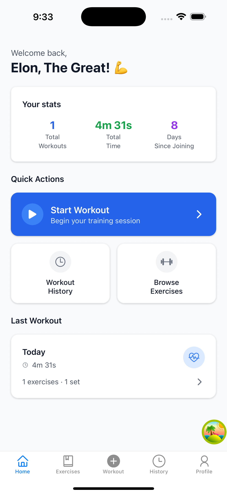
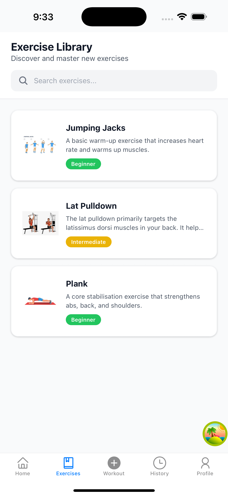
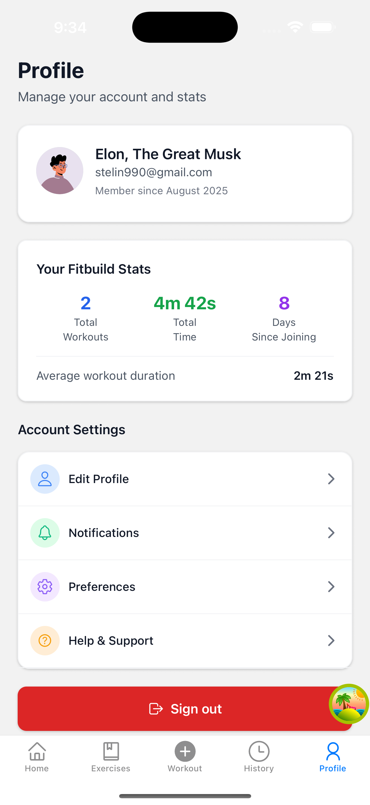

# FitBuild - Fitness App

A comprehensive fitness application built with React Native (Expo) frontend and NestJS backend, integrated with Sanity CMS for content management and AI-powered exercise instructions.

## Project Structure

### 📱 Frontend (`expo-app/`)
- **React Native with Expo** - Cross-platform mobile app
- **NativeWind** - Tailwind CSS for React Native
- **TypeScript** - Type-safe development
- **Tab-based navigation** - Workout, Exercises, History, Profile
- **Authentication** - Sign in/up functionality

### 🚀 Backend (`server/`)
- **NestJS** - Scalable Node.js framework
- **TypeScript** - Type-safe API development
- **SWC** - Fast compilation
- **Environment-based configuration** - Secure API key management
- **Request logging** - Incoming requests and response status tracking

### 📝 Content Management (`sanity-studio/`)
- **Sanity CMS** - Headless content management
- **Exercise content** - Exercise types, workout plans
- **Real-time collaboration** - Content editing and management
- **API integration** - Backend connectivity

## Key Features

- **Exercise Library** - Browse and search exercises
- **AI-Powered Instructions** - Get personalized exercise guidance
- **Workout Tracking** - Monitor your fitness progress
- **Content Management** - Easy exercise and workout content updates
- **Cross-Platform** - Works on iOS and Android

## Tech Stack

- **Frontend**: React Native, Expo, NativeWind, TypeScript
- **Backend**: NestJS, TypeScript, SWC
- **CMS**: Sanity Studio
- **AI**: OpenRouter API
- **Database**: Sanity (Headless CMS)

## Getting Started

1. **Frontend**: Navigate to `expo-app/` and run `npm install && npm start`
2. **Backend**: Navigate to `server/` and run `npm install && npm run start:dev`
3. **CMS**: Navigate to `sanity-studio/` and run `npm install && npm run dev`

## Environment Setup

Each service requires its own environment configuration:
- **Backend**: Sanity project ID, API token, OpenRouter API key
- **Frontend**: Backend API URL, authentication keys
- **CMS**: Sanity project configuration

## Development

- **API Documentation**: Available at `/api` endpoints
- **Real-time Logging**: Request/response tracking in backend
- **Type Safety**: Full TypeScript support across all services
- **Hot Reload**: Development mode with automatic reloading

## API Endpoints

### Exercises
- `GET /api/exercises` - Get all exercises (requires `X-API-KEY` header)
- `GET /api/exercises/:id` - Get exercise by ID (requires `X-API-KEY` header)

### AI Services
- `POST /api/ai/exercise-instructions` - Get AI-generated exercise instructions (requires `X-API-KEY` header)

### Health
- `GET /api/health` - Health check endpoint (requires `X-API-KEY` header)

## Deployment

### Backend
- Configure environment variables
- Build with SWC: `npm run build`
- Deploy to your preferred hosting service

### Frontend
- Build for production: `expo build`
- Deploy to app stores or use EAS Build

### CMS
- Deploy Sanity Studio to Vercel or Netlify
- Configure production dataset

## Screenshots

👉 [View more screenshots](./expo-app-screen-shots)

## Contributing

1. Fork the repository
2. Create a feature branch
3. Make your changes
4. Add tests if applicable
5. Submit a pull request

## License

This project is licensed under the MIT License - see the LICENSE file for details.

## Support

For support and questions:
- Check the documentation in each service directory
- Review the API endpoints and their usage
- Ensure all environment variables are properly configured
